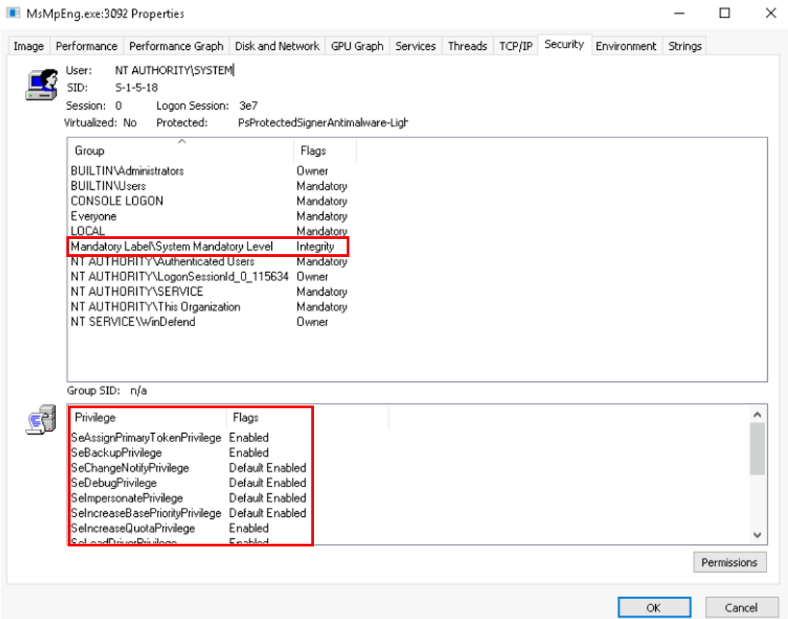
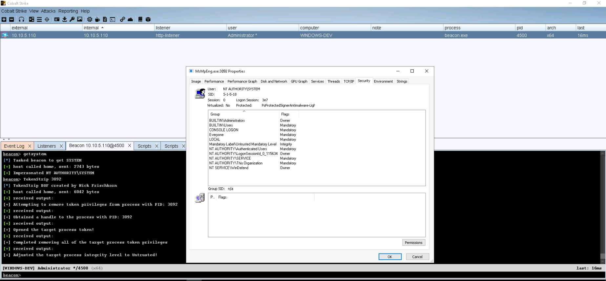

### TokenStripBOF

TokenStrip is a Beacon Object File implementation of pwn1sher's [KillDefender](https://github.com/pwn1sher/KillDefender/) project utilizing syscalls via [InlineWhispers](https://github.com/outflanknl/InlineWhispers).

This project aims to weaken AV and EDR products by deleting the process' token privileges and then lowering the integrity level to untrusted. 

**Note: **System privileges are required to run this BOF!

##### How To Compile
```
$ git clone https://github.com/nick-frischkorn/TokenStripBOF.git && cd TokenStripBOF
$ x86_64-w64-mingw32-gcc -c TokenStrip.c -o TokenStripBOF.o -masm=intel
```





