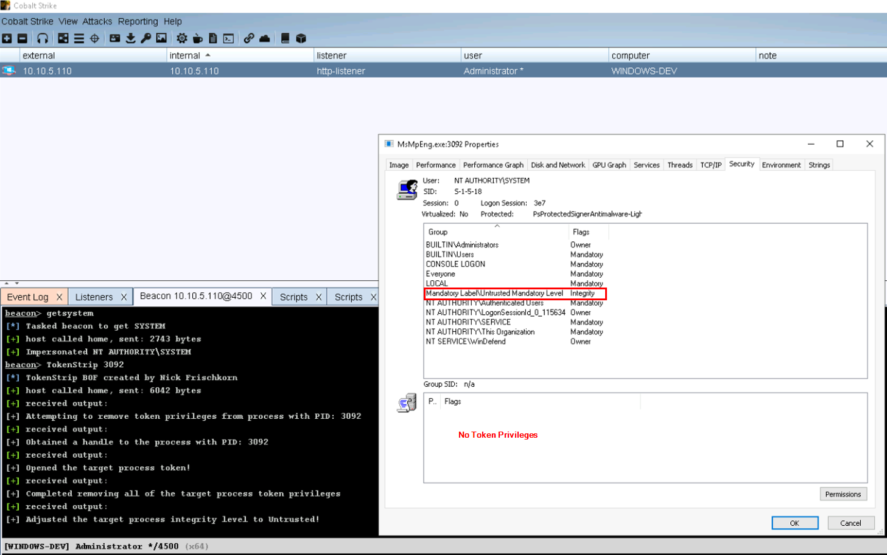

## TokenStripBOF

TokenStrip is a Beacon Object File implementation of pwn1sher's [KillDefender](https://github.com/pwn1sher/KillDefender/) project utilizing syscalls via [InlineWhispers](https://github.com/outflanknl/InlineWhispers).

This project aims to weaken AV and EDR products by deleting the process' token privileges and then lowering the integrity level to untrusted. 

**Note:** System privileges are required to run this BOF!
### How To Compile
```
$ git clone https://github.com/nick-frischkorn/TokenStripBOF.git && cd TokenStripBOF/src
$ x86_64-w64-mingw32-gcc -c TokenStrip.c -o TokenStripBOF.o -masm=intel
[OR]
$ git clone https://github.com/nick-frischkorn/TokenStripBOF.git && cd TokenStripBOF/src
$ x86_64-w64-mingw32-gcc -c TokenStrip.c -o TokenStripBOF.o -masm=intel -Wall -DBOF
$ x86_64-w64-mingw32-strip --strip-unneeded TokenStripBOF.o
```
### Usage
Load the aggressor script
```
beacon> TokenStrip <PID>
beacon> TokenStrip 9085
```
### To Do
This was my first attempt at making a BOF and I could not figure out how to get [SysWhispers2BOF](https://github.com/FalconForceTeam/SysWhispers2BOF) to work so I opted for InlineWhispers. Some improvements to make are upgrading to dynamically resolving syscall numbers and jumping to syscall instructions within ntdll.dll similar to techniques displayed in [SysWhispers3](https://github.com/klezVirus/SysWhispers3).

Additionally, have to clean up the header files and delete the unused structs

### Before


### After

